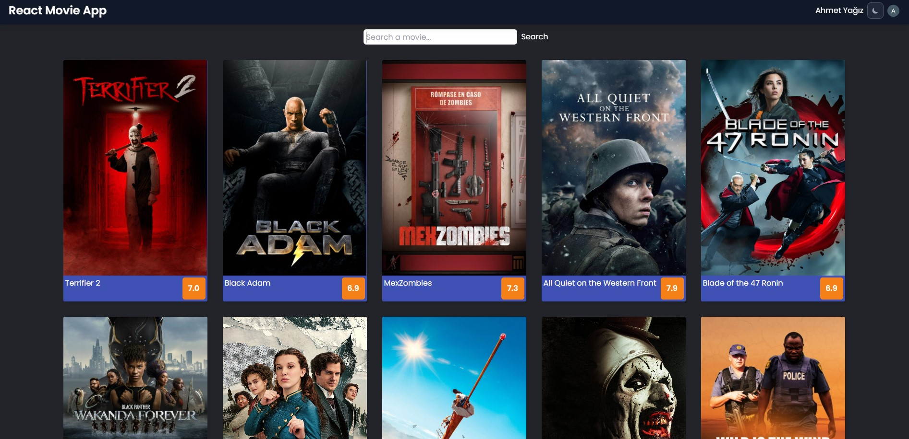

# Project: Movie App

## Description

Project aims to create a Movie App.

## Problem Statement

- We are adding a new project to our portfolios. So you and your colleagues have started to work on the project.

## Project Skeleton

```
006 - Movie App (folder)
|
|----readme.md        
SOLUTION
├── public
│     └── index.html
├── src
│    ├── auth
│    │     └── firebase.js
│    ├── components
│    │     ├── MovieCard.js
│    │     └── Navbar.js
│    ├── context
│    │     └── AuthContext.js
│    ├── pages
│    │     ├── Login.js
│    │     ├── Register.js
│    │     ├── Main.js
│    │     └── MovieDetail.js
│    ├── router
│    │     └── Router.js
│    ├── App.js
│    ├── App.css
│    ├── index.js
│    └── index.css
├── package.json
├── .env
└── yarn.lock
```



## Expected Outcome


## Objective

Build a Movie App using ReactJS.

### At the end of the project, following topics are to be covered;

- HTML

- CSS

- JS

- ReactJS

### At the end of the project, students will be able to;

- improve coding skills within HTML & CSS & JS & ReactJS.

- use git commands (push, pull, commit, add etc.) and Github as Version Control System.
